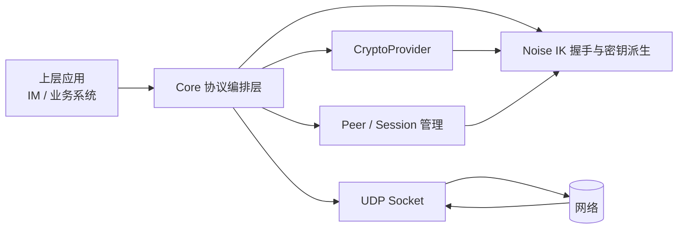

# nexusNo

一个基于 WireGuard 风格密钥体系与 Noise IK 握手的点对点私有通信协议实现。

本项目刻意舍弃了 WireGuard 的 VPN、TUN/TAP、路由转发、网段管理等能力，只保留“身份认证 + 安全建联 + 加密传输”这一条最核心的链路，目标是给上层应用提供一个直接、轻量、可控的私有通信底座。

## News

1. 正在做命名空间隔离，这样会让代码看起来更清爽一些。而且可以不再实例化不包含状态的crypto和noise方法。
2. 实现之后需要重新拼装，需要花点时间。
3. 当前是wg作为第一层命名空间，后面有三层：crypto, noise, core

## 项目定位

nexusNo 不是一个 VPN，也不是一个网络隧道工具。它更像是一层面向应用的安全传输协议：

- 用公钥标识身份
- 用 Noise IK 完成双向认证与会话协商
- 用 AEAD 对业务数据做端到端加密
- 用 UDP 承载消息收发
- 将上层协议、消息语义和业务状态完全交给应用自己决定

换句话说，它要解决的是“两个已知身份的节点，如何直接、安全、低耦合地说话”。

## 通信前提

要建立通信，双方需要同时满足以下条件：

- 双方都持有对方的长期公钥，通常是 32 字节公钥的 Base64 表示
- 双方网络互相可达
- 至少一方能够主动发起握手，或者双方都能在收到握手包后完成响应

在这个前提下，nexusNo 就可以把“身份确认”和“加密通信”从业务系统里抽离出来，形成一个独立的协议层。

## 协议做什么

当前实现与设计重点主要包括以下几部分：

### 身份与密钥

- 长期静态密钥对管理
- 公钥作为 peer 身份
- 预共享密钥扩展
- 静态公钥与静态公钥之间的预计算，减少握手期开销

### 握手流程

- 基于 Noise IK 的三步握手语义
- 握手发起、响应、cookie 回包
- 握手状态机管理
- 反重放保护与握手计数控制

### 传输层

- 以 UDP 为底层载体
- 对业务 payload 做加密与解密
- 维护收发方向不同的会话密钥
- 支持 keypair 生命周期轮换
- 支持接收索引定位与 replay 检查

### Peer 管理

- 以公钥为索引管理 peer
- 每个 peer 维护自己的 handshake、keypair、endpoint 和统计信息
- 允许上层应用按自己的策略更新 endpoint 和会话状态

## 目前已有的核心组件

本仓库当前的核心代码已经覆盖了协议层最重要的几块能力：

- `CryptoProvider` 抽象：封装 DH、Hash、HMAC、KDF、AEAD、随机数等基础密码学能力
- `NoiseProtocol`：负责 Noise IK 风格握手、会话建立与 transport 加解密
- `Core`：负责 peer 编排、索引定位、UDP 收发入口、消息分发
- `Peer` 与 `Keypair`：负责长期身份、会话密钥与运行时状态管理
- 协议消息结构：定义握手消息、 cookie reply 和 transport data 的 wire format

## 架构视图

从分层上看，nexusNo 的职责很清晰：

- 上层只关心“和谁发消息、发什么消息、收到什么消息”
- Core 负责把消息安全地送到对端并把解密后的明文交回上层
- Noise 与密码学细节完全封装在协议层内部

## 协议流程

### 1. 身份注册

上层先把对端长期公钥注册进系统。公钥即身份，身份即访问控制边界。

### 2. 建立会话

当本地需要向某个 peer 发送消息时，协议层会先判断是否已有可用会话：

- 如果没有会话，则先完成 Noise IK 握手
- 如果已经有会话，则直接进入加密传输

### 3. 发送业务数据

业务 payload 在进入网络之前会被加密，接收端先通过 receiver index 定位会话，再完成解密与 replay 检查，最后把明文交给上层应用。

### 4. 会话轮换

为了控制密钥生命周期，协议层会维护 current / previous / next 三个 keypair 槽位，确保会话迁移时既能平滑切换，也能尽快淘汰旧密钥。

## 适合做什么上层应用

最直接的上层应用是 IM，也就是即时通信系统。

这种设计非常适合做“去中心化或弱中心化”的私有通信，因为协议层只负责安全链路，上层可以自由定义消息类型、消息存储、离线策略和会话关系。

对于 IM 来说，它的好处很明显：

- 端到端安全：协议层只传递加密后的数据，不理解业务内容
- 身份简单：公钥就是身份，不依赖账号密码体系也能建立可信通信
- 协议收敛：传输层、认证层、密钥轮换层统一收敛在一套实现里
- 灵活上层：消息、群组、附件、已读回执、离线队列都可以由应用自己定义
- 易扩展：后续可以很自然地接入多端同步、设备管理、消息同步、端到端群聊等能力

这类架构的价值在于：协议层尽量稳定，上层产品可以快速迭代，而不会反过来污染底层安全模型。

## 优点

- 没有 VPN 的系统侵入性，不需要接管路由或虚拟网卡
- 没有业务语义耦合，协议层与应用层边界清晰
- 身份、握手、会话、数据传输都可以被单独审计
- 对于只想做“安全私聊”而不是“安全组网”的场景更直接
- 可以作为很多私有协议的基础层，而不仅限于 IM

## 劣势与限制

这个模型也有非常明确的代价：

- 双方必须同时在线，默认情况下无法像邮箱那样天然支持离线投递
- 双方网络需要互相可达，协议本身不解决 NAT 穿透、打洞和中继选择
- 不提供路由和多跳转发，因此不能替代传统 VPN
- 不处理消息可靠性、顺序保证、重试和分片重组，这些都要交给上层

这不是缺陷，而是设计取舍。协议越薄，上层越自由，但上层也要承担更多产品逻辑。

## 一个特殊模型：中心服务器型群聊

虽然 nexusNo 的核心目标是纯 P2P 通信，但它也可以自然扩展出一种“中心服务器作为特殊 peer”的模式。

这个模型可以这样理解：

- 部署一个公网可达的中心服务器
- 服务器本身也持有一对长期公私钥
- 用户只要把这个服务器的公钥加入自己的 peer 列表，并在这个服务器注册自己的公钥，就能像和普通 peer 一样与它建立安全通信
- 上层应用可以把服务器定义为“消息转发者”“离线存储者”“群聊协调者”或“状态同步中心”

在这种模式下，中心服务器不需要理解底层协议以外的复杂逻辑，它只要作为一个始终在线的特殊节点，就可以承担很多实用功能：

- 群聊消息转发
- 离线消息暂存与取回
- 在线状态与成员列表维护
- 群组元数据同步
- 多设备消息聚合

这实际上给了系统一种非常灵活的拓扑：

- 私聊时走真正的 P2P
- 群聊或离线场景时引入中心 peer 作为协调节点
- 协议底层保持不变，上层按产品需要自由组合

## 消息类型

当前协议消息结构已经覆盖了核心链路：

- `HandshakeInitiation`：握手第一条消息，由发起方发送
- `HandshakeResponse`：握手第二条消息，由响应方发送
- `CookieReply`：压力控制下的 cookie 回包
- `TransportData`：后续业务数据包

这套消息格式延续了 WireGuard 风格的设计，重点在于小而稳定的 wire format，以及明确的 receiver index 定位方式。

## 设计原则

- 身份即公钥
- 协议层只负责安全传输，不负责业务解释
- 默认拒绝未知 peer
- 先建立身份，再建立会话，最后发送业务数据
- 上层可以自由决定消息存储、可靠性和群组语义

## 现阶段说明

当前做完了协议的内容处理，peer和session的管理正在实现中。

## 与主流 IM 协议对比

从工程复杂度、适配场景和系统代价三个维度，对比 Signal、Matrix、MTProto。

### Signal 协议

特点：

- 双棘轮和预密钥体系非常成熟，前向安全和异步消息能力很强
- 生态完善，安全审计和社区信任度高
- 多设备和身份管理有大量成熟经验可借鉴

缺点：

- 整体协议栈和状态机复杂，实现门槛高
- 对服务端配合要求较高，离线投递、预密钥分发等能力不可避免
- 对于“只想快速做一个私有点对点通信层”的项目来说偏重

与 nexusNo 的差异：

- Signal 更像一整套完整 IM 安全体系
- nexusNo 更像一个薄传输层，专注已知公钥身份下的直接安全通信

### Matrix（Olm / Megolm）

特点：

- 联邦化设计，适合跨组织、跨服务器互联
- 房间模型、状态事件、历史同步等上层能力非常完整
- 生态组件丰富，适合做大规模协作和开放网络

缺点：

- 系统规模大，部署和运维复杂度高
- 协议层、同步层、服务端语义层耦合较深，学习成本高
- 对极简点对点场景来说，很多能力属于“超配”

与 nexusNo 的差异：

- Matrix 强在分布式协作生态与协议完整性
- nexusNo 强在结构简单、边界清晰、易于嵌入自己的应用协议

### MTProto

特点：

- 工程化程度高，面向大规模移动网络优化多年
- 连接管理、传输容错、性能和基础设施适配能力较强
- 在中心化服务架构下具备很强的产品可用性

缺点：

- 体系偏中心化，协议与平台能力绑定较深
- 对自定义私有部署和轻量改造不够友好
- 协议细节与实现路径对小团队不够“低认知负担”

与 nexusNo 的差异：

- MTProto 更适合大型平台化通信系统
- nexusNo 更适合小团队、实验型产品和私有化通信场景

## 我们的定位：极客玩具 Keep it simple, and trust your users.

nexusNo 不是要和以上协议正面竞争，也不追求在所有维度“更先进”。

它的目标很明确：

- 用尽量小的复杂度提供可信的身份认证与加密传输
- 让开发者快速搭出一个能跑、能用、能扩展的私有通信底座
- 把复杂性留给真正需要它的上层，而不是一开始就把全套重型架构背上

这也是为什么它可以被称为“极客玩具”：

- 它足够轻，便于理解、实验和二次开发
- 它不追求大而全，而追求可控和透明

但它也满足了大多数实际场景的核心诉求：

- 私聊场景下的安全点对点通信
- 小规模团队内部通信
- 设备间私有通道
- 引入一个常在线中心节点后的群聊与离线消息场景
